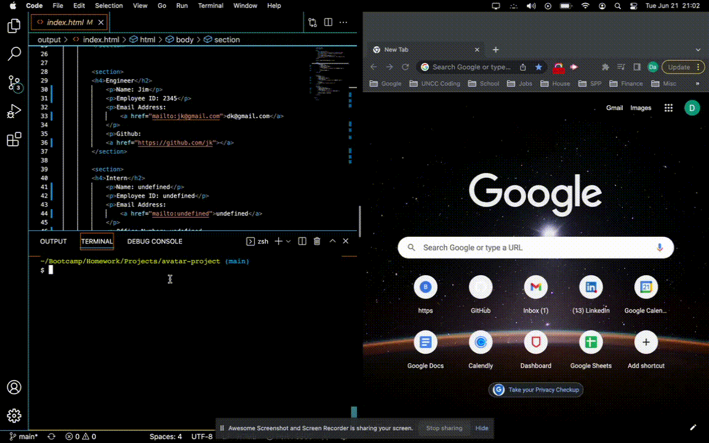

# 10 Object-Oriented Programming: Team Profile Generator

## Table of Contents

- [Description](#description)

- [Visuals](#visuals)

- [Authors and Acknowledgement](#authors-and-acknowledgement)

## Resources

- [REPOSITORY](https://github.com/okdavekk/team-profile-generator)

- [VIDEO LINK](https://www.awesomescreenshot.com/video/9576714)


## Description
### Your Task
Your task is to build a Node.js command-line application that takes in information about employees on a software engineering team, then generates an HTML webpage that displays summaries for each person. Testing is key to making code maintainable, so you’ll also write a unit test for every part of your code and ensure that it passes each test.

Because this application won’t be deployed, you’ll need to provide a link to a walkthrough video that demonstrates its functionality and all of the tests passing. You’ll need to submit a link to the video AND add it to the readme of your project.

> **Note**: There is no starter code for this assignment.

### User Story
AS A manager
I WANT to generate a webpage that displays my team's basic info
SO THAT I have quick access to their emails and GitHub profiles

### Acceptance Criteria

GIVEN a command-line application that accepts user input 

WHEN I am prompted for my team members and their information THEN an HTML file is generated that displays a nicely formatted team roster based on user input 

WHEN I start the application THEN I am prompted to enter the 
- team manager’s name, 
- employee ID, 
- email address, 
- and office number 

WHEN I enter the team manager’s name, employee ID, email address, and office number THEN I am presented with a menu with the option to add an 
- engineer 
- or an intern 
- or to finish building my team 

WHEN I select the engineer option THEN I am prompted to enter the engineer’s 
- name, 
- ID, 
- email, 
- and GitHub username, 
- and I am taken back to the menu 

WHEN I select the intern option THEN I am prompted to enter the intern’s 
- name, 
- ID, 
- email, 
- and school, 
- and I am taken back to the menu 

WHEN I decide to finish building my team 
THEN I exit the application, and the HTML is generated

WHEN I click on an email address in the HTML THEN my default email program opens and populates the TO field of the email with the address 

WHEN I click on the GitHub username THEN that GitHub profile opens in a new tab 

## Visuals

### Intended Mock-Up
The following image shows the intended mock-up of the generated HTML’s appearance and functionality:


### Command Line Prompts and HTML Page Generation


## Getting Started

This Challenge will combine many of the skills we've covered so far. In addition to the User Story and Acceptance Criteria, we’ve provided some guidelines to help get started.

Your application should use [Jest](https://www.npmjs.com/package/jest) for running the unit tests and [Inquirer](https://www.npmjs.com/package/inquirer) for collecting input from the user. The application will be invoked by using the following command:

```bash
node index.js
```

It is recommended that you start with a directory structure that looks like the following example:

```md
.
├── __tests__/             //jest tests
│   ├── Employee.test.js
│   ├── Engineer.test.js
│   ├── Intern.test.js
│   └── Manager.test.js
├── dist/                  // rendered output (HTML) and CSS style sheet      
├── lib/                   // classes
├── src/                   // template helper code 
├── .gitignore             // indicates which folders and files Git should ignore
├── index.js               // runs the application
└── package.json           
```

**Important**: Make sure that you remove `dist` from the `.gitignore` file so that Git will track this folder and include it when you push up to your application's repository.

The application must include `Employee`, `Manager`, `Engineer`, and `Intern` classes. The tests for these classes (in the `_tests_` directory) must ALL pass.

The first class is an `Employee` parent class with the following properties and methods:

* `name`

* `id`

* `email`

* `getName()`

* `getId()`

* `getEmail()`

* `getRole()`&mdash;returns `'Employee'`

The other three classes will extend `Employee`.

In addition to `Employee`'s properties and methods, `Manager` will also have the following:

* `officeNumber`

* `getRole()`&mdash;overridden to return `'Manager'`

In addition to `Employee`'s properties and methods, `Engineer` will also have the following:

* `github`&mdash;GitHub username

* `getGithub()`

* `getRole()`&mdash;overridden to return `'Engineer'`

In addition to `Employee`'s properties and methods, `Intern` will also have the following:

* `school`

* `getSchool()`

* `getRole()`&mdash;overridden to return `'Intern'`

Finally, although it’s not a requirement, consider adding validation to ensure that user input is in the proper format.


